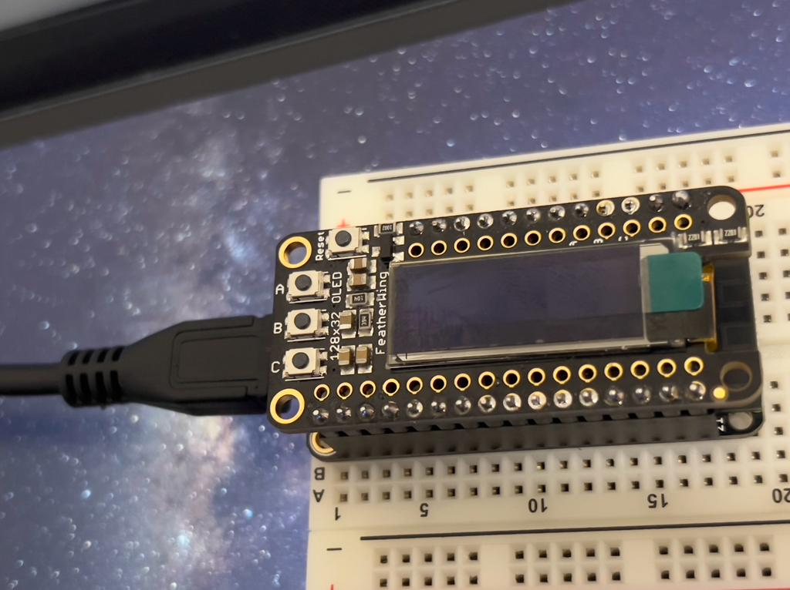
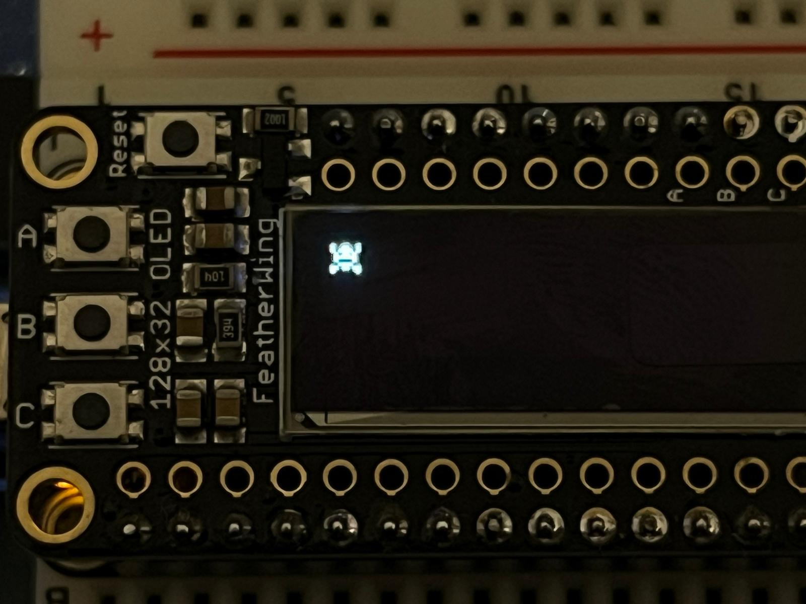
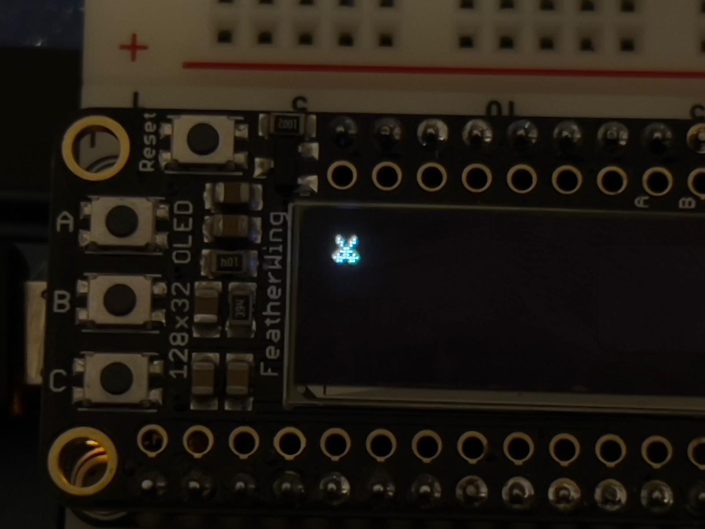
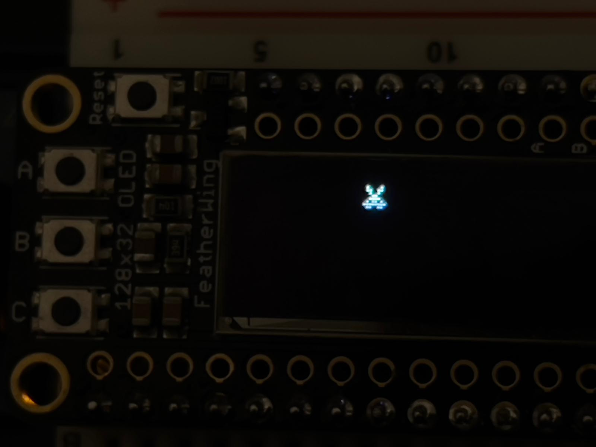
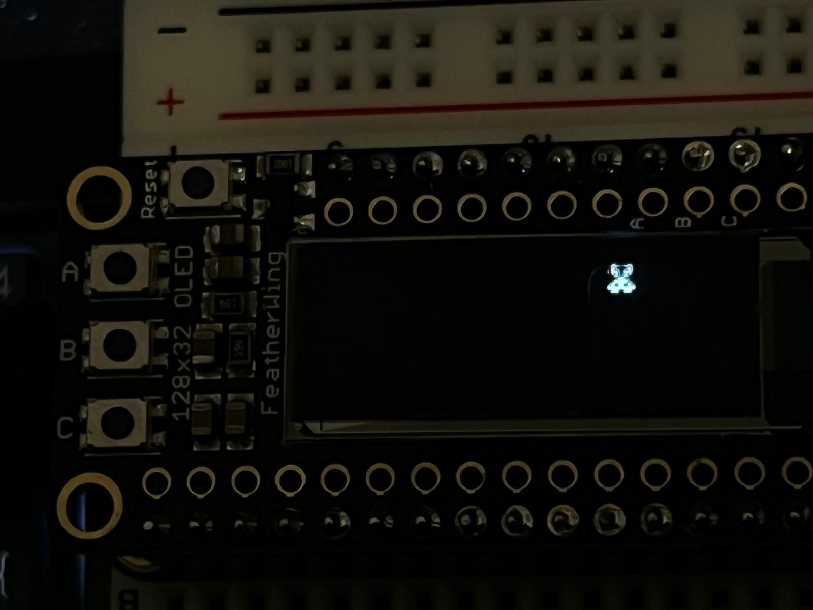
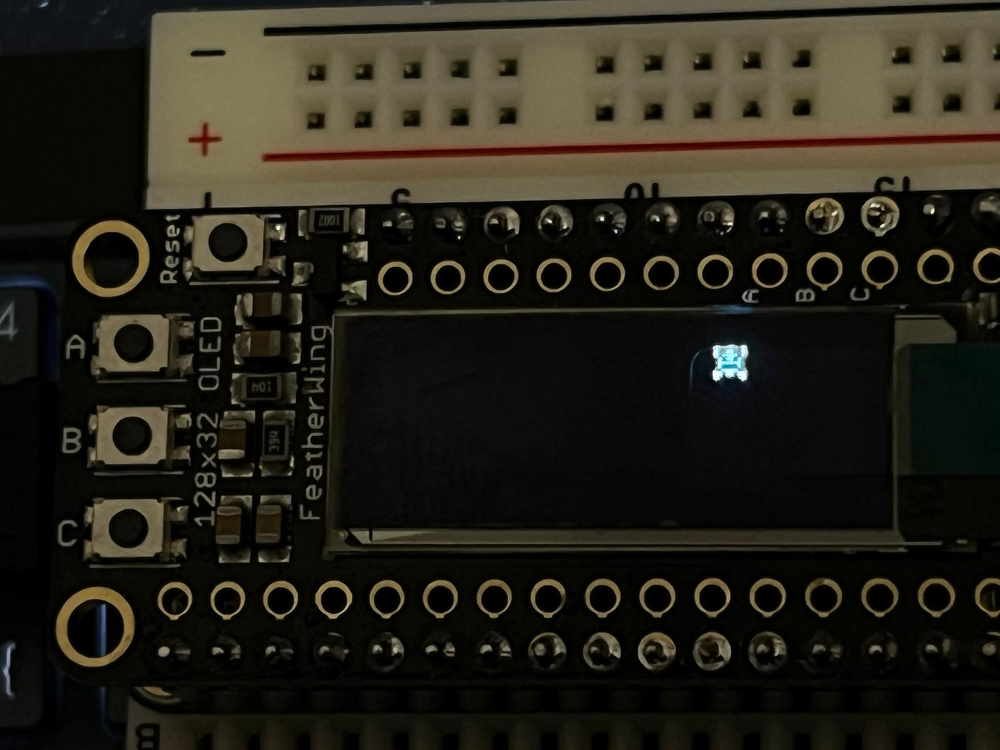

# ESP32 Monster Moving Project

- Author :[Tareq Md Rabiul Hossain CHY](https://www.linkedin.com/in/tareqmdrabiulhossainchy/), [Nushrat JAHAN](https://www.linkedin.com/in/nushrat-jahan-3275a9178/)
- ESP32 Project for [M.Sc. CPS2 Programming Connected Devices course](https://ci.mines-stetienne.fr/cps2/course/pcd/)
- Based on [Maxime Lefrançois's course](https://ci.mines-stetienne.fr/cps2/course/pcd/#_outline_of_the_lectures)

# GROUP_8

# Project Description
Our small integrated project works with a little monsters. For the project we used esp32 and oled display. After running the code a little monster will be shown on the oled display. Now we will be able to move the little monster by pressing the A button and B button. If we press the A button the monster will move to the right and if we press the B button the monster will move to the left side. While moving if the monster goes to cross the edge of OLED it will come back to display again. So, the monster won't be able to hide from dispay. Now the amazing part comes when we press the button C. It changes the monster!

# Project files
We used boot.py file for esp32 micropython code.

# Components Used

- 1 esp32
- 1 oled 128x32
- 1 usb cable
- breadboard

We used Visual studio code to run files. 

# Connection
We just need to set the oled on top of esp32 on the breadboard and need to connect with out laptop with USB cable.

# Circuit Diagram

# Output with First monster

# Output with Second monster

# Output with Second monster moving right side.

# Output with Second monster moving right side more.

# Output with First monster again.
- We can change monster in any state.  

# Project video
[Link](https://drive.google.com/drive/u/2/my-drive)

# References
- [Monster](https://www.mfitzp.com/oled-displays-i2c-micropython/)
